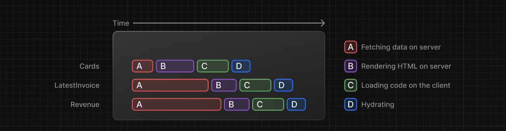

# 学習メモ

- [学習メモ](#学習メモ)
  - [clsx](#clsx)
  - [`<Layout>`](#layout)
  - [`<Link>`](#link)
    - [アクティブなリンクを表示するUI](#アクティブなリンクを表示するui)
  - [データベース（@vercel/postgres）](#データベースvercelpostgres)
    - [DB作成](#db作成)
    - [.env（.local）ファイル](#envlocalファイル)
    - [初期データ挿入](#初期データ挿入)
  - [🔰Fetching Data](#fetching-data)
  - [🔰Static and Dynamic Rendering](#static-and-dynamic-rendering)
    - [静的レンダリングとは](#静的レンダリングとは)
    - [動的レンダリングとは](#動的レンダリングとは)
      - [利点](#利点)
    - [データの取得を静的→動的に](#データの取得を静的動的に)
  - [🔰Streaming](#streaming)
    - [loading.tsx](#loadingtsx)
    - [ルートにおける()の意味](#ルートにおけるの意味)
    - [Suspenseを使って、コンポーネント単位でストリーミングさせる](#suspenseを使ってコンポーネント単位でストリーミングさせる)
  - [🔰Adding Search（検索機能）](#adding-search検索機能)
    - [検索機能の実装](#検索機能の実装)
    - [1. ユーザーの入力をキャプチャ](#1-ユーザーの入力をキャプチャ)
    - [2. 検索パラメータでURLを更新](#2-検索パラメータでurlを更新)
    - [3. URLと入力を同期](#3-urlと入力を同期)
    - [4. テーブルの更新](#4-テーブルの更新)
    - [`useSearchParams()`フックと、`searchParams`プロップの使い分け](#usesearchparamsフックとsearchparamsプロップの使い分け)
    - [Best practice: Debouncing](#best-practice-debouncing)
  - [⚠️🔰pagination](#️pagination)

## clsx

[参考サイト]("https://qiita.com/gotomeltdown/items/11bfa9c17cf820eb3ccf")

例えば、stateが"error"の時は文字色を赤、"success"の時は緑にする。  
などのpropsやstateに基づいて動的にクラス名を変更したい時に役立つ。

```javascript
<div
  className={clsx('text-2xl font-bold', {
    'text-red-400': state === 'error',
    'text-green-400': state === 'success',
  })}
>
  テキスト
</div>
```

## `<Layout>`

`<Layout>`を使用する利点の1つは、`page`コンポーネントだけが更新されて、`layout`コンポーネントは再レンダリングされない（部分レンダリング）

**ルートレイアウト**は必須！！

## `<Link>`

`<a>`タグではなく`<Link>`タグを使うことで、遷移時にページ全体が再レンダリングされることなく、ユーザーが新しいルートに移動しても、ブラウザはページをリロードせず、変更されたルートセグメントだけが再レンダリングされる。

### アクティブなリンクを表示するUI

- `next/navigation`から`usePathname()`を使用（現在のURLのパス名を読み取るためのクライアントコンポーネントフック）
- 先頭に`use client`必要
- `clsx`ライブラリを使って、リンクがアクティブな時にクラスを適用させる。

```javascript
'use client';

import {
  UserGroupIcon,
  HomeIcon,
  DocumentDuplicateIcon,
} from '@heroicons/react/24/outline';
import Link from 'next/link';
import clsx from 'clsx';
import { usePathname } from 'next/navigation';

// Map of links to display in the side navigation.
// Depending on the size of the application, this would be stored in a database.
const links = [
  { name: 'Home', href: '/dashboard', icon: HomeIcon },
  {
    name: 'Invoices',
    href: '/dashboard/invoices',
    icon: DocumentDuplicateIcon,
  },
  { name: 'Customers', href: '/dashboard/customers', icon: UserGroupIcon },
];

export default function NavLinks() {
  const pathname = usePathname();

  return (
    <>
      {links.map((link) => {
        const LinkIcon = link.icon;
        return (
          <Link
            key={link.name}
            href={link.href}
            className={clsx(
              'flex h-[48px] grow items-center justify-center gap-2 rounded-md bg-gray-50 p-3 text-sm font-medium hover:bg-sky-100 hover:text-blue-600 md:flex-none md:justify-start md:p-2 md:px-3',
              {
                'bg-sky-100 text-blue-600': pathname === link.href,
              },
            )}
          >
            <LinkIcon className="w-6" />
            <p className="hidden md:block">{link.name}</p>
          </Link>
        );
      })}
    </>
  );
}
```

## データベース（@vercel/postgres）

まずは、`vercel`にサインイン→デプロイ

### DB作成

1. Continue to Dashboardをクリック
2. プロジェクトダッシュボードからStorage
3. Connect Store → Create New → Postgres → Continue
4. 任意のデータベース名→リージョンはワシントン（後からリージョンは変更不可。24.01現在Japanはなし）

### .env（.local）ファイル

1. 作成が終わったら`.env.local`タブに移動し`Show secret`→`Copy Snippet`
2. コードエディターに移動し`.env`ファイル作成→コピーしたもの貼り付け
3. `.gitignore`ファイルに`.env`記述忘れずに
4. ターミナルで`npm i @vercel/postgres`を実行し、`Vercel Postgres SDK`をインストールする。

### 初期データ挿入

seedとやら  
[Nextjs.org](https://nextjs.org/learn/dashboard-app/setting-up-your-database)参照

## 🔰Fetching Data

DB作成〜

ウォーターフォール（前の処理が終わるまで次の処理が実行されない。=待つ時間が発生する）を避ける方法。  
→JavaScriptでは、Promise.all()またはPromise.allSettled()関数を使用して、すべてのプロミスを同時に開始することができる。

## 🔰Static and Dynamic Rendering

- ウォーターフォール（前の処理が終わるまで待つ必要がある。↔︎ データ取得を同時に実行する"Parallel Data Fetching"）
- 静的レンダリングなので、データの更新はアプリケーションに反映されない

### 静的レンダリングとは

> 静的レンダリングでは、データのフェッチとレンダリングは、ビルド時（デプロイ時）または再検証時にサーバー上で行われる。その後、結果をコンテンツ・デリバリー・ネットワーク（CDN）に配信し、キャッシュすることができます。

利点

- 高速
- サーバー負荷の軽減
- SEO対策

更新頻度の低いブログや製品ページなど。

### 動的レンダリングとは

> リクエスト時（ユーザーがページにアクセスした時）に、各ユーザーに対してサーバー上でコンテンツがレンダリングされます。

#### 利点

- リアルタイムデータ
- User-Specific Content
- Request Time Information

### データの取得を静的→動的に

next/cacheからunstable_noStoreをインポート

```javascript
import { unstable_noStore as noStore } from 'next/cache';

export async function fetchRevenue() {
  // Add noStore() here to prevent the response from being cached.
  // This is equivalent to in fetch(..., {cache: 'no-store'}).
  noStore();

  // ...
}
```

しかし、極端に遅い処理がひとつでもある場合、結果的にページ全体の処理が遅くなる。

## 🔰Streaming

https://nextjs.org/learn/dashboard-app/streaming

前の章では、ダッシュボード・ページをダイナミックにしましたが、データ・フェッチの遅さがアプリケーションのパフォーマンスにどのような影響を与えるかについて説明しました。ここでは、遅いデータリクエストがあったときにユーザーエクスペリエンスを改善する方法を見ていきましょう。

Next.js の App Router では `<Suspense>` を使ったストリーミングがサポートされている。  
`<Suspense>` を使ったストリーミングではページの HTML を小さな塊に分解し、その塊をクライアントに順次送信でき、この `<Suspense>` を使うことで、ページの一部をより早く表示できる。



以下でやること

1. ページレベルで`loading.tsx`ファイルを使用
2. 特定のコンポーネントでは`<Suspense>`を使用する

### loading.tsx

データ読み込みが完了するまで「Loading...」と表示させる。

loading.tsx

```javascript
export default function Loading() {
  return <div>Loading...</div>;
}
```

ローディングスケルトンを表示させる例
skeltons.tsx

```javascript
export default function DashboardSkeleton() {
  return (
    <>
      <div
        className={`${shimmer} relative mb-4 h-8 w-36 overflow-hidden rounded-md bg-gray-100`}
      />
      <div className="grid gap-6 sm:grid-cols-2 lg:grid-cols-4">
        <CardSkeleton />
        <CardSkeleton />
        <CardSkeleton />
        <CardSkeleton />
      </div>
      <div className="mt-6 grid grid-cols-1 gap-6 md:grid-cols-4 lg:grid-cols-8">
        <RevenueChartSkeleton />
        <LatestInvoicesSkeleton />
      </div>
    </>
  );
}
```

loading.tsx

```javascript
import DashboardSkeleton from '@/app/ui/skeletons';

export default function Loading() {
  return <DashboardSkeleton />;
}
```

こんな感じ


### ルートにおける()の意味

例えば上記の例で説明すると、ルートディレクトリが以下のようになっているとする。

```
dashboard
├─ invoices
│ 　└─ page.tsx
├─ customers
│ 　└─ page.tsx
├─ loading.tsx
└─ page.tsx
```

この場合、dashboardのみならず`invoices` と`customers`ページにもスケルトン（loading.tsx）が適用されてしまう。
そこで利用されるのが`Route Groups`といって、`dashboard`フォルダ内に`/(overview)`と新しいフォルダを作成し、その中にファイルを移動させることで、URLパス構造に影響を与えることがなくなる。

```
dashboard
├─ (overview)
│ 　├─ loading.tsx
│ 　└─ page.tsx
├─ invoices
│ 　└─ page.tsx
├─ customers
│ 　└─ page.tsx
├─ loading.tsx
└─ page.tsx
```

### Suspenseを使って、コンポーネント単位でストリーミングさせる

処理の遅いコンポーネントだけをストリーミングすることが可能。

1. Reactから`Suspense`をインポート
2. ストリーミングさせたいコンポーネントを`<Suspense>`で囲む
3. `fallback`でフォールバックコンポーネント（スケルトン）を渡せる

## 🔰Adding Search（検索機能）

- Next.jsのAPIである`searchParams`, `usePathname`, `useRouter`の使い方
- URL search paramsを使用して、検索とページネーションを実装

### 検索機能の実装

- `useSearchParams`: 現在のURLのパラメータにアクセスできる。  
  例えば、/dashboard/invoices?page=1&query=pendingの検索パラメータは、{page：'1', query：pending'}
- `usePathname`: 現在のURLのパスを読み取る。/dashboard/invoicesに対して、usePathnameは'/dashboard/invoices'を返す。
- `useRouter`: 🔰 https://nextjs.org/docs/app/api-reference/functions/use-router

1. ユーザーの入力をキャプチャ
2. search paramsでURLを更新
3. URLをinputフィールドと同期させておく
4. search queryを反映するためにテーブルを更新する

### 1. ユーザーの入力をキャプチャ

search.tsx

```javascript
'use client';

export default function Search({ placeholder }: { placeholder: string }) {
  const handleSearch = (term: string) => {
    console.log(term);
  };

  return (
    <div>
      <label htmlFor="search" className="sr-only">
        Search
      </label>
      <input
        placeholder={placeholder}
        onChange={(e) => handleSearch(e.target.value)}
      />
    </div>
  );
}
```

### 2. 検索パラメータでURLを更新

1. `next/navigation`から`useSearchParams`フックをインポートし、変数に代入
2. `handleSearch`の内部で、新しい`searchParams`変数を使用して新しい[`URLSearchParams`](https://developer.mozilla.org/ja/docs/Web/API/URLSearchParams/URLSearchParams)インスタンスを作成。
3. ユーザーの入力に基づいてparams文字列を設定（`set()`, `delete()`）  
   [`URLSearchParams: set()`](https://developer.mozilla.org/ja/docs/Web/API/URLSearchParams/set)

```javascript
let url = new URL('https://example.com?foo=1&bar=2');
let params = new URLSearchParams(url.search);

// 3 つ目のパラメーターを追加
params.set('baz', 3);
params.toString(); // "foo=1&bar=2&baz=3"
```

4. クエリ文字列ができたので、Next.jsの`useRouter`と`usePathname`フックを使ってURLを更新する。  
   `useRouter`と`usePathname`を`next/navigation`からインポートし、`handleSearch`内で`useRouter()`の`replace`メソッドを使用

/app/ui/search.tsx

```javascript
'use client';

import { MagnifyingGlassIcon } from '@heroicons/react/24/outline';
import { useSearchParams, useRouter, usePathname } from 'next/navigation';

export default function Search({ placeholder }: { placeholder: string }) {
  const searchParams = useSearchParams();

  const pathname = usePathname();
  const { replace } = useRouter();

  const handleSearch = (term: string) => {
    const params = new URLSearchParams(searchParams);
    if (term) {
      params.set('query', term);
    } else {
      params.delete('query');
    }

    replace(`${pathname}?${params.toString()}`);
  };

  return (
    <div>
      <label htmlFor="search" className="sr-only">
        Search
      </label>
      <input
        placeholder={placeholder}
        onChange={(e) => handleSearch(e.target.value)}
      />
    </div>
  );
}
```

- `${pathname}`は現在のパス。
- ユーザーが検索バーに入力すると、`params.toString()`がこの入力をURLフレンドリーなフォーマットに変換する。
- `replace(${pathname}?${params.toString()})`は、URLをユーザの検索データで更新する。例えば、ユーザが "Lee "と検索した場合、`/dashboard/invoices?query=lee`となる。
- Next.jsのクライアントサイドナビゲーション（ページ間のナビゲーションの章で学びました）のおかげで、URLはページをリロードすることなく更新されます。

### 3. URLと入力を同期

`defaultValue`を渡す。

**valueとdefaultValue**
入力された値をステートで管理する場合はvalue属性を使用してたが（React）、ステートを使用しないのでdefaultValueを使用できる。この辺に関しては要学習。

```javascript
<input
  className="peer block w-full rounded-md border border-gray-200 py-[9px] pl-10 text-sm outline-2 placeholder:text-gray-500"
  placeholder={placeholder}
  onChange={(e) => {
    handleSearch(e.target.value);
  }}
  defaultValue={searchParams.get('query')?.toString()}
/>
```

searchParams.get()の例

```javascript
'use client';

import { useSearchParams } from 'next/navigation';

export default function SearchBar() {
  const searchParams = useSearchParams();

  const search = searchParams.get('search');

  // URL -> `/dashboard?search=my-project`
  // `search` -> 'my-project'
  return <>Search: {search}</>;
}
```

### 4. テーブルの更新

1. `<Table>`にpropsで`query`と`currentPage`を渡す。

/app/dashboard/invoices/page.tsx

```javascript
import Pagination from '@/app/ui/invoices/pagination';
import Search from '@/app/ui/search';
import Table from '@/app/ui/invoices/table';
import { CreateInvoice } from '@/app/ui/invoices/buttons';
import { lusitana } from '@/app/ui/fonts';
import { Suspense } from 'react';
import { InvoicesTableSkeleton } from '@/app/ui/skeletons';

export default async function Page({
  searchParams,
}: {
  searchParams?: {
    query?: string;
    page?: string;
  };
}) {
  const query = searchParams?.query || '';
  const currentPage = Number(searchParams?.page) || 1;

  return (
    <div className="w-full">
      <div className="flex w-full items-center justify-between">
        <h1 className={`${lusitana.className} text-2xl`}>Invoices</h1>
      </div>
      <div className="mt-4 flex items-center justify-between gap-2 md:mt-8">
        <Search placeholder="Search invoices..." />
        <CreateInvoice />
      </div>
      <Suspense key={query + currentPage} fallback={<InvoicesTableSkeleton />}>
        <Table query={query} currentPage={currentPage} />
      </Suspense>
      <div className="mt-5 flex w-full justify-center">
        {/* <Pagination totalPages={totalPages} /> */}
      </div>
    </div>
  );
}
```

2. `<Table>`コンポーネントでは`fetchFilteredInvoices()`関数に`query`と`currentPage`を渡す。

/app/ui/invoices/table.tsx

```javascript
// ...
export default async function InvoicesTable({
  query,
  currentPage,
}: {
  query: string;
  currentPage: number;
}) {
  const invoices = await fetchFilteredInvoices(query, currentPage);
  // ...
}
```

3. `fetchFilteredInvoices`関数は、渡ってきたクエリパラメータを含んだものを検索して`<Table>`に表示させる。

```javascript
const ITEMS_PER_PAGE = 6;
export async function fetchFilteredInvoices(
  query: string,
  currentPage: number,
) {
  noStore();

  const offset = (currentPage - 1) * ITEMS_PER_PAGE;

  try {
    const invoices = await sql<InvoicesTable>`
      SELECT
        invoices.id,
        invoices.amount,
        invoices.date,
        invoices.status,
        customers.name,
        customers.email,
        customers.image_url
      FROM invoices
      JOIN customers ON invoices.customer_id = customers.id
      WHERE
        customers.name ILIKE ${`%${query}%`} OR
        customers.email ILIKE ${`%${query}%`} OR
        invoices.amount::text ILIKE ${`%${query}%`} OR
        invoices.date::text ILIKE ${`%${query}%`} OR
        invoices.status ILIKE ${`%${query}%`}
      ORDER BY invoices.date DESC
      LIMIT ${ITEMS_PER_PAGE} OFFSET ${offset}
    `;

    return invoices.rows;
  } catch (error) {
    console.error('Database Error:', error);
    throw new Error('Failed to fetch invoices.');
  }
}
```

### `useSearchParams()`フックと、`searchParams`プロップの使い分け

> 検索パラメータを抽出するために2つの異なる方法を使用していることに気づいたかもしれません。どちらを使うかは、クライアントで作業しているかサーバで作業しているかによります。

- `<Search>`: クライアントコンポーネントなので`useSearchParams()`
- `<Table>`: それ自身のデータを取得するサーバーコンポーネントなので、`searchParams` propを渡せる。

一般的なルールとして、クライアントからパラメータを読み込みたい場合は`useSearchParams()`を使用する。

### Best practice: Debouncing

現在の状態だと、1文字入力する毎に間髪入れずURLが更新される = キーストロークのたびにDBに問い合わせが走る。  
ユーザーが入力を止めた時に問い合わせるようにしたい。

1. `npm i use-debounce`
2. `useDebouncedCallback`関数をインポート
3. 任意の時間（300ミリ秒）セット

@/app/ui/search.tsx

```javascript
// ...
import { useDebouncedCallback } from 'use-debounce';

// Inside the Search Component...
const handleSearch = useDebouncedCallback((term) => {
  console.log(`Searching... ${term}`);

  const params = new URLSearchParams(searchParams);
  if (term) {
    params.set('query', term);
  } else {
    params.delete('query');
  }
  replace(`${pathname}?${params.toString()}`);
}, 300);
```

## ⚠️🔰pagination

`totalPages`に、`fetchInvoicesPages`関数で取得した総ページ数を渡す。

/app/dashboard/invoices/page.tsx

```javascript
// ...
import { fetchInvoicesPages } from '@/app/lib/data';

export default async function Page({
  searchParams,
}: {
  searchParams?: {
    query?: string,
    page?: string,
  },
}) {
  const query = searchParams?.query || '';
  const currentPage = Number(searchParams?.page) || 1;

  const totalPages = await fetchInvoicesPages(query);

  return (
    // ...
  );
}
```

`fetchInvoicesPages`では以下のような処理

```javascript
const ITEMS_PER_PAGE = 6;
export async function fetchInvoicesPages(query: string) {
  noStore();

  try {
    const count = await sql`SELECT COUNT(*)
    FROM invoices
    JOIN customers ON invoices.customer_id = customers.id
    WHERE
      customers.name ILIKE ${`%${query}%`} OR
      customers.email ILIKE ${`%${query}%`} OR
      invoices.amount::text ILIKE ${`%${query}%`} OR
      invoices.date::text ILIKE ${`%${query}%`} OR
      invoices.status ILIKE ${`%${query}%`}
  `;

    const totalPages = Math.ceil(Number(count.rows[0].count) / ITEMS_PER_PAGE);
    return totalPages;
  } catch (error) {
    console.error('Database Error:', error);
    throw new Error('Failed to fetch total number of invoices.');
  }
}
```

`(Number(count.rows[0].count) / ITEMS_PER_PAGE)`で、クエリ情報に一致した投稿数 / 6。  
`Math.ceil`は、引数として与えた数以上の最小の整数を返します。
（6件/6 = 1ページ, 10件/6 = 1.66666 = 2ページ）

propsで渡す。

```javascript
<Pagination totalPages={totalPages} />
```

pagination.tsx

```javascript
'use client';

import { ArrowLeftIcon, ArrowRightIcon } from '@heroicons/react/24/outline';
import clsx from 'clsx';
import Link from 'next/link';
import { generatePagination } from '@/app/lib/utils';
// usePathname,useSearchParamsをインポート
import { usePathname, useSearchParams } from 'next/navigation';

export default function Pagination({ totalPages }: { totalPages: number }) {
  const pathname = usePathname();
  const searchParams = useSearchParams();
  const currentPage = Number(searchParams.get('page')) || 1;

 // reatePageURLという新しい関数を作成。検索と同様に、URLSearchParamsを使って新しいページ番号を設定し、pathNameを使ってURL文字列を作成する。
  const createPageURL = (pageNumber: number | string) => {
    const params = new URLSearchParams(searchParams);
    params.set('page', pageNumber.toString());
    return `${pathname}?${params.toString()}`;
  };

  // ...
}
```

search.tsx

```javascript
'use client';

import { MagnifyingGlassIcon } from '@heroicons/react/24/outline';
import { usePathname, useRouter, useSearchParams } from 'next/navigation';
import { useDebouncedCallback } from 'use-debounce';

export default function Search({ placeholder }: { placeholder: string }) {
  const searchParams = useSearchParams();
  const { replace } = useRouter();
  const pathname = usePathname();

  const handleSearch = useDebouncedCallback((term) => {
    const params = new URLSearchParams(searchParams);
    // ユーザーが新しい検索クエリをタイプしたときに、ページ番号を1にリセット
    params.set('page', '1');
    if (term) {
      params.set('query', term);
    } else {
      params.delete('query');
    }
    replace(`${pathname}?${params.toString()}`);
  }, 300);

```
